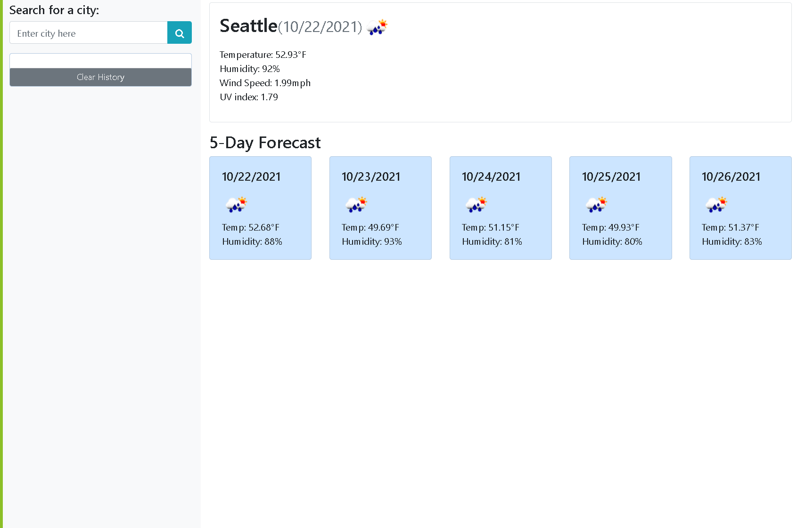

# op-week6-homework
File for my week 6 homework assignment
## Languages used
HTML, CSS, Bootstrap, JavaScript, JQuery
## Summary
I created a 5 day forecast using an API key from openweathermap.org</br>
The weather forecast uses logic to include the weather patterns for the present and for the next 5 days</br>
The text area input saves to local storage.
## Preview of the site


## Code Snippet 
```
// GIVEN a weather dashboard with form inputs
// WHEN I search for a city
// THEN I am presented with current and future conditions for that city and that city is added to the search history

searchCityButton.on('click', function(Event){
    console.log('submit button clicked!!')
    Event.preventDefault();
    let searchValue = searchCity.val().trim();
    currentCondition(searchValue);
    searchHistoryList(searchValue);
    searchCity.val('');
});

clearHistoryButton.on('click', function(){
    citiesList = [];
    listArray();
    $(this).addClass('hide');
});
```
## My Links
[Deployed weather forecast](https://oscarp76.github.io/op-week6-homework/),
[GitHub](https://github.com/OscarP76)
